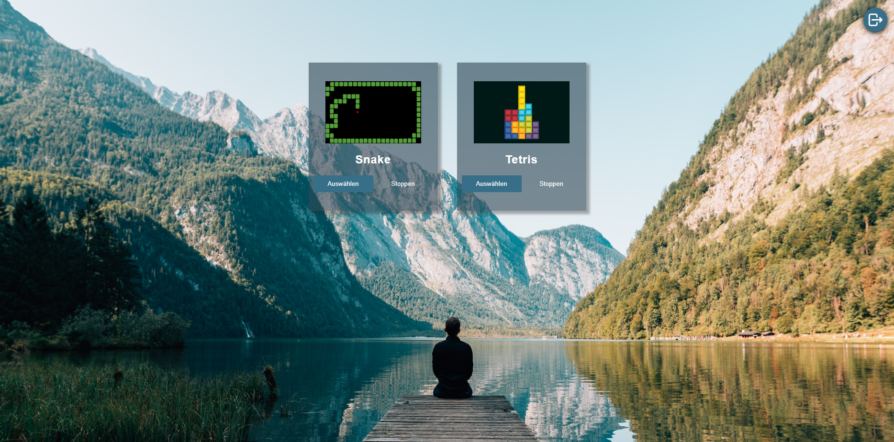
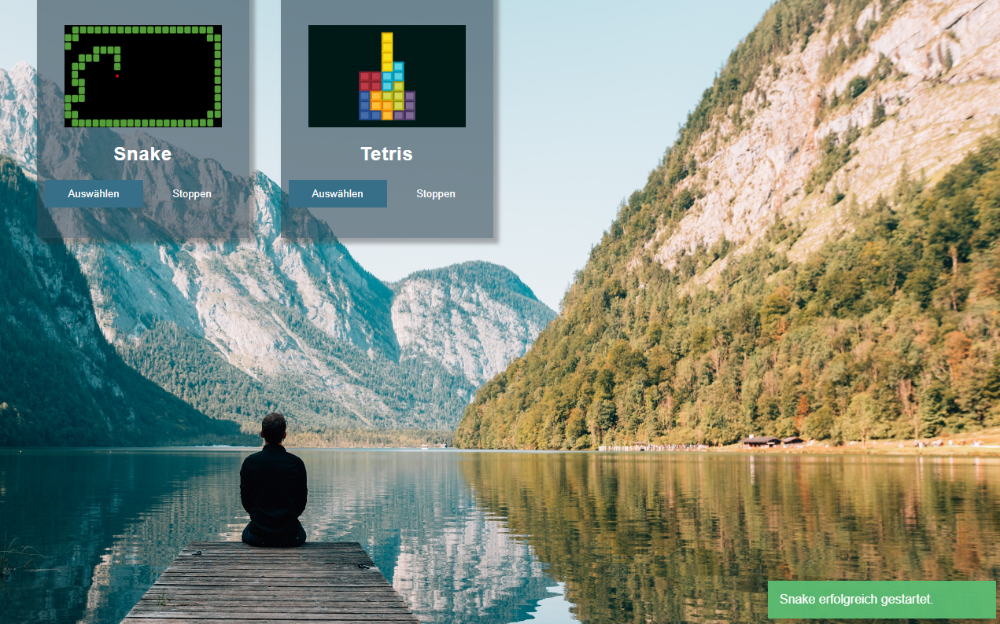

# Game select

With this Website, you can start and stop Games on a Raspberry Pi, using [SystemCtl](https://wiki.ubuntuusers.de/systemd/systemctl/).

## Login

The authorization is handled with [JWT](https://jwt.io). For the authentication, [bcrypt](https://de.wikipedia.org/wiki/Bcrypt) is used to hash password savely. The autorization tokens are stored in the local storage of the webbrowser. When u enter the login page, it checks whether a token is stored and valid or not and you will automatically get redirected to the selection page.

### Login failure

If the login fails due to an empty password or username input, or wrong user credentials, a message will popup above the login button, to let the user know, whats wrong.

## Game selection

When you login, you will see the game selection page. You can either logout on the top right, so the stored token gets removed and you will be redirected to the login page, or you select to start or stop a game.

A message will show in the bottom right corner when you start or stop a game.

## dotenv

The following variables have to be set in an .env file in the backend:

|variable|description|default|
|-|-|-|
|JWT_SECRET_TOKEN|token for signing and validating jwt token|"MY_SECRET_TOKEN1"|
|JWT_TOKEN_EXPIRE|value when the login will expire|'5m'|